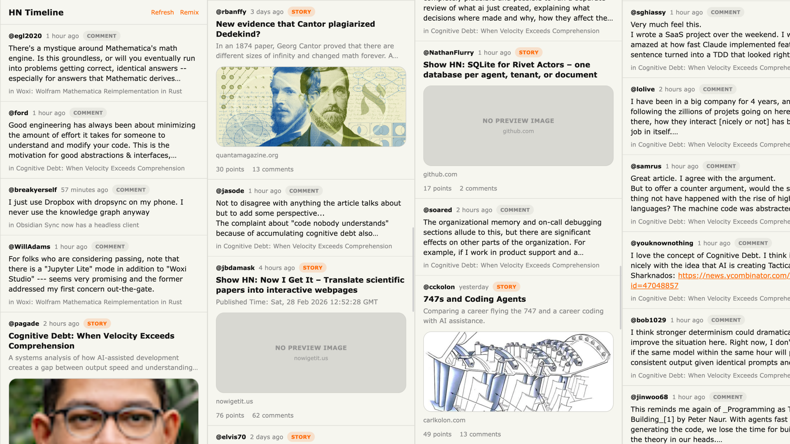

# HN Timeline (Twitter-style Mobile Feed)



Mobile-first React app that mixes Hacker News top stories and comments into a single vertical timeline.

## Demo

https://hackernews.lukestephens.co.za

## Run

```bash
bun install
bun run dev
```

Dev server binds to `0.0.0.0` (configured in scripts and Vite config).

## Routes

- `/` mixed timeline of top 10 stories + sampled comments
- `/post/:id` story detail with full loaded comment thread
- `/comment/:id` comment-focused view with descendant replies

## Module layout

- `src/api` Hacker News API client
- `src/domain` types + mappers + time helpers
- `src/feed` snapshot fetch + story/comment mixing
- `src/components` reusable UI cards and avatar
- `src/routes` route screens
- `src/utils` sanitize helpers
- `src/styles` Tailwind + theme styles

## Notes

- Theme is Hacker News-inspired (`#ff6600`, `#f6f6ef`, Verdana-like typography).
- Layout is Twitter-inspired mobile timeline style.
- Feed mixing is deterministic per seed and can be remixed client-side.
